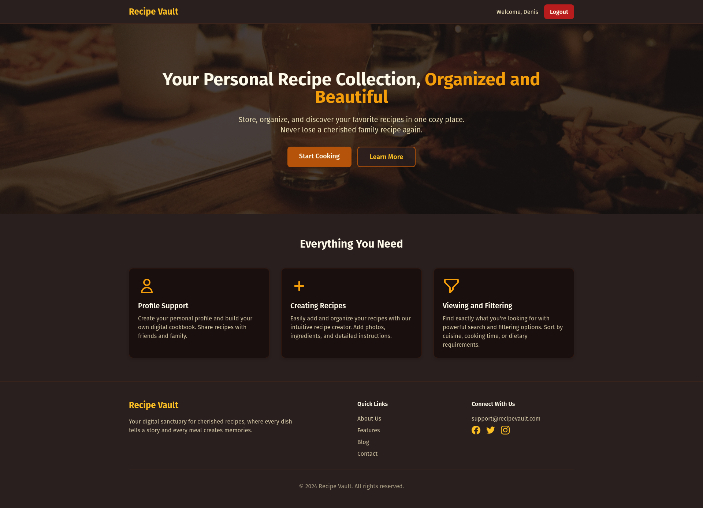
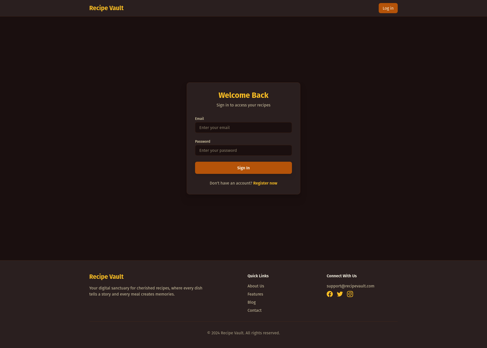
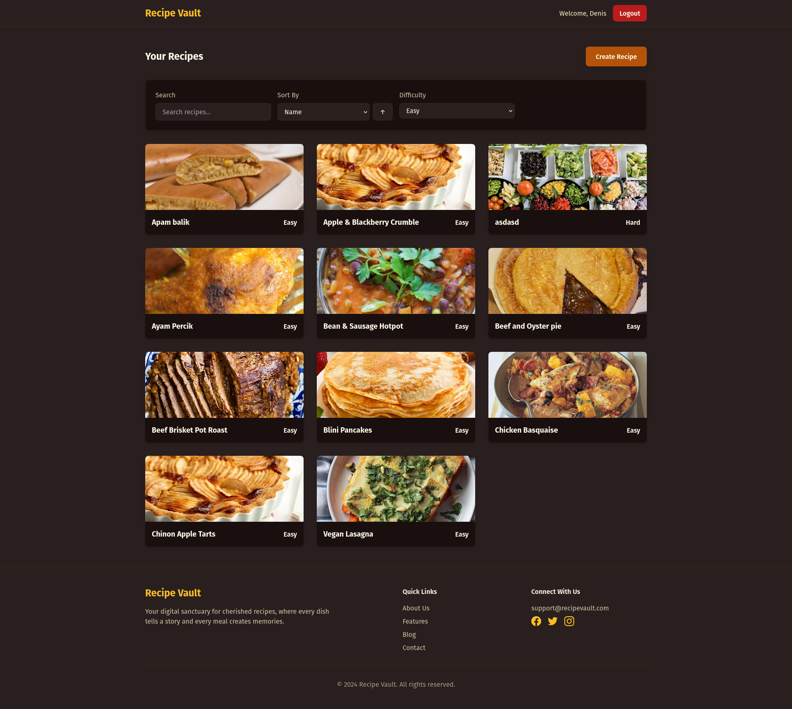
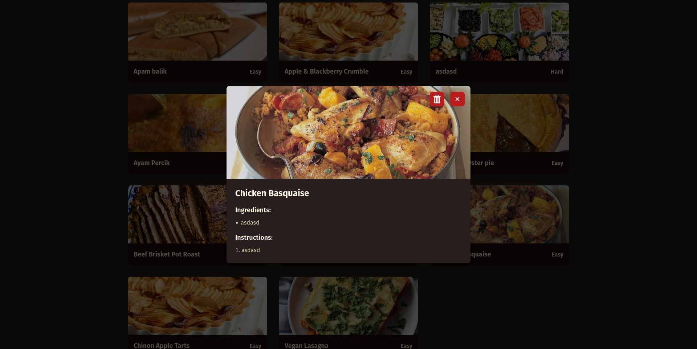
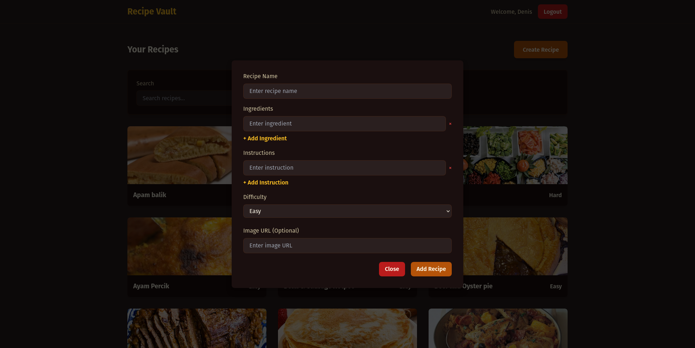

# Recipe Vault

Welcome to **Recipe Vault**, your all-in-one digital cookbook! Store and organize your favorite recipes with ease.

## 🌟 Features

- **🗂️ Recipe Organization:** Easily categorize and search for your recipes.
- **🌐 Responsive Design:** Access your recipes seamlessly on any device.

## 🖼️ Screenshots

### Landing Page


### Login Page


### Register Page


### Recipe List Page


### Recipe Details Page


### Create Recipe Page


## 🚀 Getting Started

### Prerequisites

- **Node.js** (v14 or higher)
- **npm** (v6 or higher)

### Installation

1. Clone the repository:
   ```bash
   git clone https://github.com/denisss555555555/Recipe-Vault.git
   ```
2. Navigate to the project directory:
   ```bash
   cd Recipe-Vault
   ```
3. Install dependencies:
   ```bash
   npm install
   ```

### Development

Start the development server:

```bash
npm run dev
```

### Build

Build the project for production:

```bash
npm run build
```

## 🛠️ Technologies Used

- **Vue.js**
- **Vite**
- **TypeScript**
- **Vite**
- **Tailwind**

